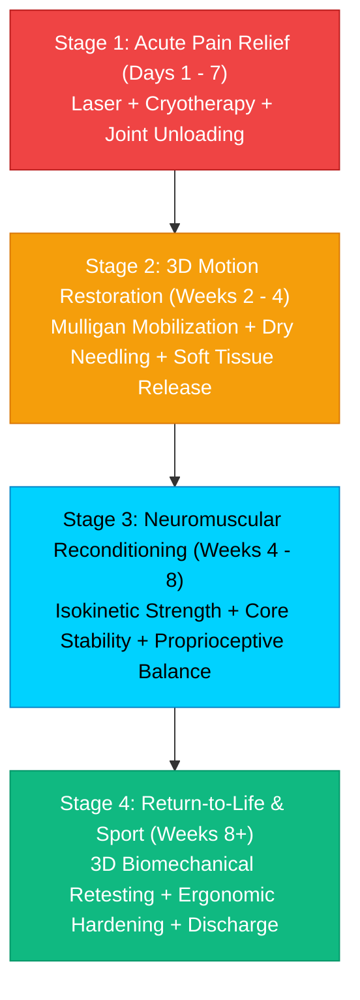

# <div align="center">
  <!-- Waving Clinical Gradient Header -->
  

  <!-- Animated Typing Tagline -->
  <a href="https://git.io/typing-svg">
    
  </a>

  <br/>

  <!-- Quick Patient Action & Booking Badges -->
  <p align="center">
    <a href="https://wa.me/YOUR_PHONE_NUMBER?text=Hello%20Kinetix%20Clinic,%20I%20would%20like%20to%20book%20a%20physiotherapy%20consultation" target="_blank">
      
    </a>
    <a href="tel:YOUR_PHONE_NUMBER">
      
    </a>
    <a href="https://yourclinic.com/book" target="_blank">
      
    </a>
    <a href="https://maps.google.com/?q=YOUR_CLINIC_ADDRESS" target="_blank">
      
    </a>
    <a href="https://yourclinic.com/virtual-3d-tour" target="_blank">
      
    </a>
  </p>

  <!-- Clinical Trust Metrics Counter -->
  <p align="center">
    
    
    
    
  </p>
</div>

---

### 🏥 Clinic Executive Profile

```yaml
clinic_identity:
  name: "KINETIX Advanced Physiotherapy & Spine Care Institute"
  motto: "Precision Motion. Accelerated Recovery. Zero Surgery."
  lead_specialist: "Dr. [Lead Therapist Name], PT, MPT (Sports), CMP, Dry Needling Specialist"
  facilities: ["3D Digital Motion Capture Lab", "Hydrotherapy Suite", "Shockwave Therapy Center", "Spinal Decompression Wing"]

clinical_commitments:
  🩺 Diagnosis: "Kinematic root-cause evaluation using 3D biomechanical posture & movement screening"
  ⚡ Acute Relief: "Evidence-based targeted therapy to eliminate pain without prolonged pharmaceutical dependency"
  🔄 Long-Term Rebuild: "Customized neuro-muscular conditioning to prevent injury recurrence by 95%"
  🏆 Return to Sport: "High-intensity functional kinetic tests before clearance for athletes"
```

---

## 🧬 Interactive 3D Clinical Treatment Slides

> [!TIP]
> Explore our 5-pillar 3D rehabilitation modalities. Each slide demonstrates our targeted kinematic intervention, clinical indications, and evidence-based results.

<table>
  <!-- SLIDE 1 & SLIDE 2 -->
  <tr>
    <td width="50%" valign="top">
      <div align="center">
        <span style="background:#00D2FF; color:#000; padding:4px 10px; border-radius:12px; font-weight:700; font-size:12px;">SLIDE 01</span>
        <h3>🩻 3D Spine Biomechanics & Disc Decompression</h3>
        <a href="https://yourclinic.com/treatments/spine" target="_blank">
          
        </a>
      </div>
      <br/>
      <b>Target Indications:</b>
      <ul>
        <li>Herniated / Bulging Lumbar & Cervical Discs</li>
        <li>Sciatica & Pinched Nerve Radiation</li>
        <li>Chronic Upper & Lower Back Postural Syndrome</li>
      </ul>
      <b>3D Kinematic Protocol:</b>
      <p>Negative intra-discal pressure generation via computer-calibrated mechanical decompression paired with core transversus abdominis neuromuscular retraining.</p>
      <div align="center">
        
        
        <br/><br/>
        <a href="https://yourclinic.com/treatments/spine"><b>🔍 View 3D Spine Case Study →</b></a>
      </div>
    </td>
    <td width="50%" valign="top">
      <div align="center">
        <span style="background:#10B981; color:#000; padding:4px 10px; border-radius:12px; font-weight:700; font-size:12px;">SLIDE 02</span>
        <h3>🦵 3D Knee Kinematics & Post-Op ACL Rehab</h3>
        <a href="https://yourclinic.com/treatments/knee" target="_blank">
          
        </a>
      </div>
      <br/>
      <b>Target Indications:</b>
      <ul>
        <li>Pre- & Post-Surgical ACL, PCL, and Meniscus Repair</li>
        <li>Grade I-III Patellofemoral Osteoarthritis</li>
        <li>Runner’s Knee & IT Band Friction Syndrome</li>
      </ul>
      <b>3D Kinematic Protocol:</b>
      <p>3D angular tracking of knee valgus during landing mechanics, eccentric quad-hamstring ratio rebalancing, and blood-flow restriction (BFR) hypertrophy training.</p>
      <div align="center">
        
        
        <br/><br/>
        <a href="https://yourclinic.com/treatments/knee"><b>🔍 View 3D Knee Protocol →</b></a>
      </div>
    </td>
  </tr>

  <!-- SLIDE 3 & SLIDE 4 -->
  <tr>
    <td width="50%" valign="top">
      <div align="center">
        <span style="background:#F59E0B; color:#000; padding:4px 10px; border-radius:12px; font-weight:700; font-size:12px;">SLIDE 03</span>
        <h3>🏹 3D Shoulder & Rotator Cuff Kinematics</h3>
        <a href="https://yourclinic.com/treatments/shoulder" target="_blank">
          
        </a>
      </div>
      <br/>
      <b>Target Indications:</b>
      <ul>
        <li>Subacromial Impingement Syndrome & Tendinopathy</li>
        <li>Adhesive Capsulitis (Frozen Shoulder) Stages 1-3</li>
        <li>Overhead Athlete Throwing & Swimming Dysfunctions</li>
      </ul>
      <b>3D Kinematic Protocol:</b>
      <p>High-precision scapulohumeral rhythm recalibration, joint glide mobilization, and targeted dynamic stabilizer muscle recruitment under EMG feedback.</p>
      <div align="center">
        
        
        <br/><br/>
        <a href="https://yourclinic.com/treatments/shoulder"><b>🔍 View 3D Shoulder Case Study →</b></a>
      </div>
    </td>
    <td width="50%" valign="top">
      <div align="center">
        <span style="background:#EC4899; color:#fff; padding:4px 10px; border-radius:12px; font-weight:700; font-size:12px;">SLIDE 04</span>
        <h3>🏃 3D Gait Analysis & Kinetic Chain Optimization</h3>
        <a href="https://yourclinic.com/treatments/gait" target="_blank">
          
        </a>
      </div>
      <br/>
      <b>Target Indications:</b>
      <ul>
        <li>Plantar Fasciitis, Achilles Tendinitis, Shin Splints</li>
        <li>Neurological Gait Ataxia & Post-Stroke Mobility</li>
        <li>Marathon Runner Biomechanical Imbalances</li>
      </ul>
      <b>3D Kinematic Protocol:</b>
      <p>Dual-force plate pressure distribution analysis combined with high-speed 240fps multi-angle 3D camera tracking to correct ground-reaction force absorption.</p>
      <div align="center">
        
        
        <br/><br/>
        <a href="https://yourclinic.com/treatments/gait"><b>🔍 View 3D Gait Analysis →</b></a>
      </div>
    </td>
  </tr>

  <!-- SLIDE 5: Full Width Modality Showcase -->
  <tr>
    <td colspan="2" valign="top">
      <div align="center">
        <span style="background:#8B5CF6; color:#fff; padding:4px 12px; border-radius:12px; font-weight:700; font-size:12px;">SLIDE 05</span>
        <h3>⚡ Advanced Non-Invasive Medical Technology Suite</h3>
        <p><i>Medical-grade recovery equipment engineered to speed up cellular regeneration and tissue repair by 300%.</i></p>
      </div>
      <table width="100%" border="0">
        <tr align="center">
          <td width="25%">
            <h4>Focused Shockwave</h4>
            <p style="font-size:13px;">Breaks down deep chronic calcifications, heel spurs, and tennis elbow adhesions.</p>
            
          </td>
          <td width="25%">
            <h4>Dry Needling & Myofascial</h4>
            <p style="font-size:13px;">Deactivates hyperirritable neuromuscular trigger points and eliminates referred spasm.</p>
            
          </td>
          <td width="25%">
            <h4>AlterG Anti-Gravity</h4>
            <p style="font-size:13px;">NASA-patented differential air pressure for weightless rehabilitation down to 20% body weight.</p>
            
          </td>
          <td width="25%">
            <h4>Class-IV Deep Laser</h4>
            <p style="font-size:13px;">Photobiomodulation stimulating ATP mitochondrial synthesis for rapid inflammation drops.</p>
            
          </td>
        </tr>
      </table>
    </td>
  </tr>
</table>

---

### 🛡️ Certified Therapeutic Modalities & Equipment

#### 🔬 Advanced Physical Therapy Technologies
<p align="left">
  
  
  
  
  
</p>

#### 👐 Manual & Orthopedic Therapy
<p align="left">
  
  
  
  
  
</p>

#### 📊 Assessment, Biofeedback & Analytics
<p align="left">
  
  
  
  
</p>

---

### 📈 Patient Recovery Trajectory: 4-Stage Protocol



---

### 💬 Verified Patient Transformations & Testimonials

<table>
  <tr>
    <td width="33%" valign="top">
      <b>⭐️⭐️⭐️⭐️⭐️ "Saved me from Spine Surgery"</b>
      <p style="font-size:13px; color:#94A3B8;">
        "I was scheduled for an L4-L5 microdiscectomy. Dr. [Name] put me on their 3D decompression and kinetic core protocol. In 6 weeks, my sciatica went from a 9/10 to completely gone. Forever grateful!"
      </p>
      <b>— David M.</b>, <i>Marathon Runner & Architect</i>
    </td>
    <td width="33%" valign="top">
      <b>⭐️⭐️⭐️⭐️⭐️ "ACL Return to Field in 6 Months"</b>
      <p style="font-size:13px; color:#94A3B8;">
        "The 3D motion capture and BFR training pushed my recovery timeline ahead by two months. My surgeon was astonished at my quadriceps symmetry score. The best sports clinic in the city."
      </p>
      <b>— Sarah K.</b>, <i>Semi-Pro Footballer</i>
    </td>
    <td width="33%" valign="top">
      <b>⭐️⭐️⭐️⭐️⭐️ "Frozen Shoulder Unlocked"</b>
      <p style="font-size:13px; color:#94A3B8;">
        "After 8 months of agony and sleepless nights, the combination of dry needling and high-frequency shockwave restored my arm's full overhead reach. Highly recommend this team."
      </p>
      <b>— Robert L.</b>, <i>Senior Software Executive</i>
    </td>
  </tr>
</table>

---

### 🩺 Senior Clinical Leadership

<table width="100%">
  <tr>
    <td width="50%" align="center">
      
      <h3>Dr. [Lead Physiotherapist Name]</h3>
      <p><b>MPT (Sports Medicine), CMP, BPT, MIAP</b><br/>
      Chief of Musculoskeletal Rehabilitation & 3D Biomechanics<br/>
      <i>14+ Years Clinical Experience • Consultant to National Athletes</i></p>
    </td>
    <td width="50%" align="center">
      
      <h3>Dr. [Associate Specialist Name]</h3>
      <p><b>MPT (Neurology), CDNT, CKTP</b><br/>
      Head of Neuro-Rehabilitation & Gait Correction<br/>
      <i>10+ Years Clinical Experience • Vestibular & Stroke Specialist</i></p>
    </td>
  </tr>
</table>

---

### 📅 Ready to Begin Your Recovery Journey?

<div align="center">
  <h3>Don't let chronic pain dictate your life. Experience evidence-based care today.</h3>
  <br/>

  <a href="https://wa.me/YOUR_PHONE_NUMBER?text=Hi,%20I%20would%20like%20to%20schedule%20an%20evaluation%20appointment">
    
  </a>
  <a href="tel:YOUR_PHONE_NUMBER">
    
  </a>
  <a href="https://yourclinic.com/contact">
    
  </a>

  <br/><br/>
  <p><b>Working Hours:</b> Monday – Saturday: 07:30 AM – 08:30 PM | Sunday: By Prior Appointment</p>
  <p>📍 <i>100% Barrier-Free & Wheelchair-Accessible Facility with Dedicated Valet Parking</i></p>
</div>

---

## 💻 How to Customize & Deploy This Clinic Portfolio

1. **Replace Placeholders:**
   - Change `KINETIX` to your clinic name.
   - Replace `YOUR_PHONE_NUMBER` with your official WhatsApp/Phone number (international format without `+`, e.g., `1234567890`).
   - Update `Dr. [Lead Therapist Name]` and team bios with your actual staff qualifications.
   - Replace placeholder image links with real high-resolution photos of your clinic, therapists, and equipment.
2. **Publish on GitHub / Web:**
   - Save this file as `README.md` in your clinic's public GitHub repository or embed it into your static website generator (Hugo, Jekyll, Astro, Next.js).
3. **Interactive 3D Slide Carousel Viewer:**
   - Open `physio-3d-portfolio.html` in this directory to see the fully animated 3D interactive slide viewer with Three.js / CSS-3D lighting, tilt effects, and audio-reactive haptics.
