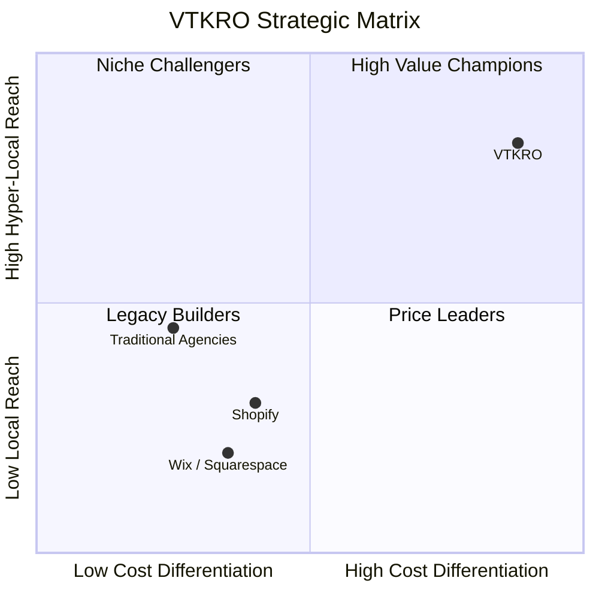

# 📊 Comprehensive Business, Product & Strategic Report: VTKRO
**Platform:** [VTKRO — India's Most Affordable Website Builder](https://www.vtkro.com/)  
**Headquarters:** Bhilai, Chhattisgarh, India  
**Target Market:** Indian Small & Medium Enterprises (MSMEs), Local Retailers, Freelancers, & Professionals  
**Date of Report:** September 2026  

---

## 1. Executive Summary

**VTKRO** (`vtkro.com`) is an Indian indigenous website-building platform and digital enablement service tailored specifically for local businesses across Tier-1, Tier-2, and Tier-3 cities in India. 

Operating under the tagline *"Built in Bhilai. Built for Local India"*, VTKRO directly tackles the two biggest barriers preventing India's 63+ million MSMEs from going digital:
1. **Recurring Subscription Fatigue:** Mainstream global platforms (Shopify, Wix, Squarespace, WordPress hosting) charge ongoing monthly/yearly subscriptions in USD or high INR brackets.
2. **Agency Overhead & Complexity:** Traditional digital marketing agencies charge between **₹15,000 to ₹50,000+** upfront for basic 5-page static websites, often with technical lock-ins.

VTKRO disrupts this space with a radical, transparent commercial model: **₹5,000 One-Time Payment** with **lifetime hosting, zero subscriptions, free template swaps, and complete ownership**.

---

## 2. Commercial & Pricing Architecture

| Feature | VTKRO Offering | Traditional Web Agency | Global SaaS Builders (Wix/Shopify) |
| :--- | :--- | :--- | :--- |
| **Pricing Model** | **₹5,000 One-Time Flat** | ₹15,000 – ₹50,000 | ₹800 – ₹2,500 / month (~₹10,000–₹30,000/yr) |
| **Recurring Fees** | **₹0 (Zero monthly/annual fees)** | ₹3,000 – ₹10,000/yr for hosting | Mandatory recurring subscription |
| **Trial Model** | **Free to Build & Preview** (Pay only at go-live) | Upfront advance required (30–50%) | Limited trial / restricted features |
| **Post-Launch Redesign** | **Free Template Swaps** | Billable at hourly agency rates | Limited by theme change fees |
| **Invoicing** | **GST-Compliant Tax Invoice** (ITC eligible) | Often unorganized / additional 18% | Often foreign invoices / billing issues |
| **Refund Policy** | **7-Day Money-Back Guarantee** | Non-refundable advances | Strict pro-rated or non-refundable |

---

## 3. Product Features & Technical Capabilities

### A. The Website Package (Included in the ₹5,000 Tier)
* **6-Page Complete Architecture:** Standard structure covering Home, About, Services/Products, Gallery/Showcase, Testimonials, and Contact.
* **139+ Industry-Specific Templates:** Spanning over 67 business categories including Gyms (e.g., *Beast Mode Gym*), Salons (*Glamour Salon*), Bakeries (*Bake House*), Catering Services (*Zaika Catering*), Clinics, Advocates, Auto Garages, and Consultancies.
* **High-Performance Managed Hosting:** Pre-bundled, zero-maintenance hosting without server management headaches.
* **AI-Assisted Copywriting:** An integrated AI engine that generates localized, professional business copy and descriptions in seconds.
* **No-Code Drag-and-Drop Editor:** Allows non-technical business owners to swap banners, adjust layouts, and upload imagery from a desktop or mobile device.
* **Mobile-First & PWA Responsiveness:** Pixel-perfect rendering across budget smartphones, tablets, laptops, and 4K displays.
* **Built-in SEO & Open Graph Meta:** Search-engine-friendly clean semantic markup, social card previews (WhatsApp, LinkedIn, Twitter/X), and rapid load speeds.

### B. WhatsApp-First Localized Onboarding
Recognizing that many Indian shop owners find computer dashboards intimidating, VTKRO operates a two-pronged onboarding flow:
1. **Self-Service Web App:** Browser-based editor at `vtkro.com/templates`.
2. **"Done-For-You" WhatsApp Bot Onboarding (`+91 62634 39523`):** Business owners simply send their business card, photos, service details, and pricing via WhatsApp, and the VTKRO team configures the entire site for them.
3. **WhatsApp Conversion Widgets:** Websites include 1-click WhatsApp chat buttons, automated lead inquiry capture, and WhatsApp direct ordering.

---

## 4. The Growth Engine: Referral Partner Program (Refer & Earn)

A cornerstone of VTKRO's rapid distribution model is its aggressive, decentralized affiliate network:

* **High-Pound Commission:** **₹2,000 flat payout per sale** — a massive **40% direct revenue share** distributed back to partners.
* **Target Demographics:** College students, content creators, freelancers, digital marketing agencies, local insurance/field agents.
* **Zero Barrier to Entry:** Free registration with instant **Aadhaar-based e-KYC** (completed in < 2 minutes).
* **Affiliate Tooling:**
  * Personal tracking dashboard with real-time conversion metrics.
  * Instant-payout wallet integration.
  * Unique tracked links and dynamic **QR codes** for in-person merchant visits.
  * Pre-packaged marketing collateral: brochures, social media creatives, WhatsApp video teasers, and pitch decks.
  * Gamified leaderboard bonuses and monthly top-earner recognition.

*Earning Math:* Referring just 10 local businesses per month yields **₹20,000/month** in pure profit for an agent without inventory or investment risk.

---

## 5. Security, Legal & Governance Framework

* **Corporate Entity:** Registered Indian commercial company with headquarters in **Bhilai, Chhattisgarh**.
* **Data Privacy Compliance:** Strictly compliant with the **Digital Personal Data Protection (DPDP) Act, 2023**.
* **Statutory Officer:** Appointed Grievance Officer in compliance with India's **Information Technology (IT) Act, 2000**.
* **Data Encryption:** TLS/SSL encryption for data in transit and AES-256 at rest.
* **Payment Infrastructure:** Backed by **Cashfree Payments** (supporting UPI, RuPay, Visa, Mastercard, Net Banking).
* **Legal Jurisdiction:** Seat of arbitration and dispute resolution located in Bhilai, Chhattisgarh.
* **Support Channels:** 24/7 phone assistance (`+91 62634 39523`) and email ticketing (`support@vtkro.com`).

---

## 6. SWOT Analysis

### Strengths (S)
* **Unbeatable Price-to-Value Ratio:** ₹5,000 one-time eliminates the psychological barrier of recurring SaaS bills.
* **Hyper-Localized Cultural Fit:** WhatsApp-driven onboarding matches real-world Indian merchant habits.
* **Viral Incentive Distribution:** ₹2,000 per referral turns thousands of local youth into commissioned sales representatives.
* **Zero Technical Friction:** AI copy generation and free post-launch template swaps eliminate buyer remorse.

### Weaknesses (W)
* **High Unit Commission Payout (40%):** Requires consistent transaction volume to maintain healthy platform gross margins.
* **One-Time Revenue Model:** Unlike recurring SaaS, lifetime customer value (LTV) relies on future upselling (e.g., custom domains, e-commerce add-ons, local SEO).

### Opportunities (O)
* **Tier-2 & Tier-3 Digital Wave:** Hundreds of thousands of traditional businesses (traders, distributors, doctors, coaching centers) are seeking their first web presence under the *Digital India* expansion.
* **Value-Added Upsell Ecosystem:** Opportunity to introduce add-on services: Google Business Profile optimization, custom domain management, WhatsApp API automation, and payment gateway integration.
* **B2B White-Labeling:** Partnering with regional business associations, chambers of commerce, and CA/Tax consultant networks.

### Threats (T)
* **Aggressive Ad-Spend by Big Tech:** Global website builders expanding localized INR billing options.
* **Churn in Affiliate Networks:** Maintaining quality control among thousands of decentralized field affiliates.

---

## 7. Key Takeaways & Verdict

**VTKRO** is not just another website template library; it is a **purpose-built digital democratization platform for Bharat**. By pairing an ultra-aggressive ₹5,000 one-time pricing structure with a 40% affiliate kickback and a friction-free WhatsApp onboarding system, VTKRO possesses the exact ingredients required to win the massive, underserved Indian micro-business digital transformation wave.
